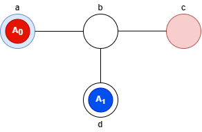

# MDD-SAT

This semestral work goal is to implement [MDD-SAT](http://surynek.net/publications/files/Surynek-Felner-Stern-Boyarski_MDD-Cost-Encoding_ECAI-2016.pdf) in Haskell.\
We will be using *makespan* (total time of plan) as our cost function.\
As our SAT solver we will use Haskell [SatSolver](http://hackage.haskell.org/package/incremental-sat-solver-0.1.8/docs/Data-Boolean-SatSolver.html).

Our program input is MAPF (multi-agent path finding) instace in .cpf format.
<details>
<summary>CPF file example</summary>

```
V =
(0:-1)[1:2:2]
(1:-1)[0:0:0]
(2:-1)[0:1:1]
(3:-1)[2:0:0]
E =
{0,1} (-1)
{1,2} (-1)
{1,3} (-1)
```


CPF is representing this MAPF instance:

</details>

Our program should retrurn the plan or at least its makespan.
